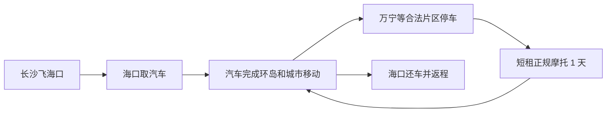

# 12 天海南环岛混合交通路线

## 交通模型

这不是摩托环岛，而是“汽车母舰＋局部摩托”的玩法：行李、头盔、相机放在汽车里，抵达适合骑行的沿海镇后停好车，再向正规店短租一天有牌照、有保险、有合同的摩托车。

### 硬约束

- 海口、三亚市区：按禁摩处理，只开车、打车或步行。
- 高速公路：摩托车不得进入。海南省政府公布的《海南省高速公路交通安全管理办法》第六条明确禁止摩托车进入高速公路。
- 跨城：全部开汽车，不用摩托赶路。
- 局部骑行：每次出发前同时向当地交警和租车行核对边界；口头“大家都这么骑”不算合规依据。
- 摩托资质：驾驶人持对应 D/E 驾照；车辆有正规号牌、行驶证、交强险和覆盖承租人的商业三者险。

法规来源：[海南省高速公路交通安全管理办法](https://www.hainan.gov.cn/hainan/szfbgtwj/201710/d8eca5de4c7a45d194aa3badde94e70e.shtml)；[海南省交通运输厅转载](https://jt.hainan.gov.cn/xxgk/0200/0202/201811/t20181122_1057044.html)。

## 逐日安排

### D1｜长沙 → 海口

- 建议航班：中午至下午抵达，不必赶凌晨廉航。
- 取车、验车、入住融旅海口酒店。
- 16:30 后：骑楼老街、钟楼周边拍人文和蓝调。
- 不安排摩托。

### D2｜海口 → 木兰湾/文昌沿海，约 90 公里

- 上午补给、转场；下午拍木兰湾风车、海岸线和灯塔方向。
- 主交通为汽车。若想骑摩托，只在住宿地附近正规短租，先确认普通道路可通行范围；不是必选项。
- 风大时不做贴海高速骑行镜头，沙地不驶入汽车或摩托。

### D3｜文昌 → 博鳌 → 万宁，约 210 公里（含绕行）

- 上午沿东线转场；博鳌只做短停。
- 15:30 后在神州半岛、石梅湾择一拍日落和海边人像。
- 住万宁 2 晚，酒店必须可停车、允许放头盔和冲浪装备。

### D4｜万宁：冲浪＋沿海摩托日

- 汽车停在住宿地或正规停车场。
- 日月湾初学者区域上 2 小时冲浪课；具体时间由教练按浪况、潮汐和风决定，不强行只排傍晚。
- 课程后短租正规摩托，在日月湾—石梅湾—神州半岛中选择**合法且不需上高速**的一小段，不追求一次跑完。
- 机车照安排在 16:30—日落，避免在车流中摆拍、压弯或逆行。

### D5｜万宁 → 陵水新村港，约 65—100 公里

- 上午休息或整理素材，下午开车至陵水。
- 选新村港、渔排、清水湾周边合法开放区域拍人文与海岸。
- 对“无人沙滩”保持警惕：没有救生员、离岸流不明的地方只拍照，不游远。

### D6｜陵水 → 后海/海棠湾，约 70 公里

- 上午转场，下午回访后海村，熟悉码头和第二天上岛动线。
- 推荐入住海棠湾 9 号等融旅特权酒店，连续住 2 晚，减少换酒店。
- 后海村拥挤区域不骑摩托，使用汽车停车后步行。

### D7｜蜈支洲岛全天

- 这是全程的“早起例外”：争取首批船，不能只下午上岛。
- 以拍摄为主则买门船票＋少量项目；以补齐海上项目为主才考虑官方套票。
- 不在同一天叠加自由潜课程或体验水肺。

### D8｜三亚天气机动日

- 若 D7 海况取消，优先顺延蜈支洲；否则在亚龙湾、三亚湾或酒店休息。
- 15:30 后拍海边人像、椰林、落日。
- 三亚市区禁摩，全天汽车/打车/步行。

### D9｜三亚 → 莺歌海 → 东方，约 180 公里（含摄影绕行）

- 上午离开三亚，下午到莺歌海盐田或开放观景区域。
- 日落前到东方鱼鳞洲附近；尊重港区、盐场和生产区边界。
- 西线补给密度低于东线，提前加油、带水。

### D10｜东方 → 棋子湾 → 峨蔓火山海岸，约 130—170 公里

- 重点拍西海岸礁石、玄武岩、渔村和低饱和落日。
- 仍以汽车为主。若当地确有正规摩托且交警确认可骑，可选择 2—3 小时乡镇短租；不为“完成任务”强行骑。
- 不靠近军事、港口敏感区域，不放无人机拍摄不明设施。

### D11｜儋州/峨蔓 → 临高角 → 海口，约 170 公里

- 上午休息，下午经临高回海口。
- 清洁车辆、备份照片、确认还车油量和划痕。
- 住海口机场或市区融旅酒店。

### D12｜海口 → 长沙

- 还车、托运行李。锂电池、相机电池、充电宝随身携带。

## 里程与驾驶强度

| 路段 | 地图基础估算 |
|---|---:|
| 海口—木兰湾 | 约 91 km |
| 木兰湾—博鳌 | 约 136 km |
| 博鳌—日月湾 | 约 77 km |
| 日月湾—陵水新村 | 约 63 km |
| 陵水—后海 | 约 67 km |
| 后海—三亚 | 约 34 km |
| 三亚—莺歌海 | 约 102 km |
| 莺歌海—东方 | 约 80 km |
| 东方—棋子湾 | 约 43 km |
| 棋子湾—峨蔓 | 约 89 km |
| 峨蔓—临高 | 约 86 km |
| 临高—海口 | 约 84 km |

基础合计约 952 km；实际按 1100—1200 km 预算。海南环岛旅游公路全长约 988 km、串联 12 个滨海市县，但“旅游公路”不代表每一段都适合或允许摩托，需按车辆类型和现场标志执行。来源：[新华社](https://www.news.cn/fortune/2023-12/18/c_1130032873.htm)、[海南省政府发布会](https://www.hainan.gov.cn/hainan/zxxx/202312/b5405486282d47c6849e205892173311.shtml)。

## 冷门海岸候选库

这些点用于根据天气临时替换，不建议全部打卡。野海岸的开放状态、停车和施工可能随时变化，到场以围挡、告示和现场管理为准。

| 区域 | 候选海岸 | 主要画面 | 玩法边界 |
|---|---|---|---|
| 文昌 | 木兰湾、淇水湾外围公共海岸 | 风车、礁石、长海岸线 | 汽车为主；风浪大时只拍不下水 |
| 万宁 | 石梅湾非酒店核心段、神州半岛公共岸线 | 椰林、弯道、日落前侧光 | 摩托只走确认允许的道路；不进入私家酒店沙滩 |
| 万宁 | 山钦湾周边 | 黑礁、海蚀地貌 | 网红野路可能封闭或危险，不翻围栏、不走崖边秘径 |
| 陵水 | 新村港、赤岭一带公共海岸 | 渔排、船、人文、清晨薄雾 | 不私自登渔排，不进入养殖生产区 |
| 乐东 | 龙沐湾、莺歌海 | 西岸长滩、盐田、落日 | 盐场仅在开放观察点拍摄，不下生产道路 |
| 东方 | 鱼鳞洲外围公共海岸 | 灯塔方向、渔船、城市落日 | 港区和敏感设施不拍，按现场标识活动 |
| 昌江 | 棋子湾公共观景岸线 | 砾石、礁石、荒野感 | 礁石湿滑、回程天黑，提前看潮汐 |
| 儋州 | 峨蔓火山海岸、龙门激浪开放区 | 玄武岩、浪花、渔村 | 不在涨潮时下礁石，不将车辆驶入未铺装岸线 |

“人少”往往也意味着无救生员、无照明、无手机信号和救援距离远。两人结伴也只在有把握的浅水区活动；摄影点不自动等于游泳点。

## 9 天压缩版

若只能 9 天：长沙飞海口、三亚返程，走海口—文昌—万宁—陵水—后海/蜈支洲—三亚，**主动放弃西线**。这样能保住东线海岸、冲浪和蜈支洲，但异地还车费与开口程机票可能抵消节省的时间。
