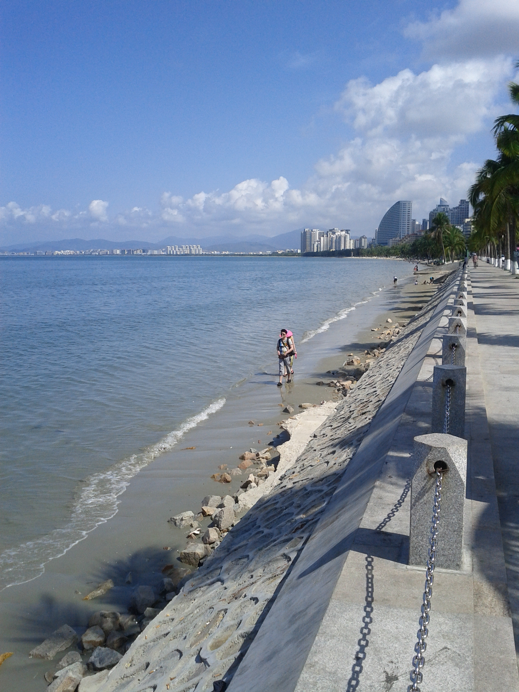

# 长沙出发｜海南混合交通深度旅行方案

## 网页版本

项目根目录包含可直接部署到 GitHub Pages 的响应式静态网站：

- `index.html`：网站入口
- `styles.css`：桌面与手机端设计
- `script.js`：移动导航、物资清单本地保存和动态预算
- `research.css` 与各目录下的 `.html`：把完整调研以正常网页排版展示，不再把访客送到裸 Markdown 页面

本地预览可使用任意静态文件服务器打开项目根目录。网页内容以本目录中的完整 Markdown 调研为依据。

这套方案按两人出行设计，核心不是“全程骑摩托”，而是：

> **租汽车完成机场、城市和环岛长距离移动；只在万宁等经复核允许通行的沿海片区，短租一天正规摩托车。海口、三亚市区不骑，摩托车不上高速。**

主方案为 **12 天 11 晚海南环岛**，以晴天、摄影、冷门海岸、蜈支洲岛、冲浪为重点；自由潜可以加进来，但若主要目标是稳定拿下 AIDA2，建议与海南旅行拆开，在东莞深池另报课程。

## 文件导航

- [执行摘要](00_总览/执行摘要.md)
- [12 天环岛混合交通路线](01_路线与交通/12天环岛混合交通路线.md)
- [长沙往返机票、汽车与摩托租赁](01_路线与交通/长沙往返机票与租车.md)
- [最佳季节与晴天策略](02_天气与时间/最佳季节与晴天策略.md)
- [融旅酒店筛选与住宿布局](03_住宿/融旅酒店筛选与住宿布局.md)
- [蜈支洲岛与海上项目](04_游玩项目/蜈支洲岛与海上项目.md)
- [自由潜水深度调研：海南还是东莞](04_游玩项目/自由潜水深度调研.md)
- [冲浪点与课程选择](04_游玩项目/冲浪调研.md)
- [风光、人文、海边人像和机车照片计划](05_摄影计划/风光人文与机车人像.md)
- [12 天详细物资清单](06_物资清单/12天详细物资清单.md)
- [两人预算评估](07_预算/两人预算评估.md)
- [真实评价与证据索引](08_真实评价与来源/平台实评与证据索引.md)
- [图片来源与许可](08_真实评价与来源/图片来源与许可.md)

## 先给结论

1. **时间**：本次按 **2026 年 8 月 15 日前后出发**执行。当前略倾向 8 月 14 日抵达；若仍在 8 月 15 日出发，选下午或晚班并把当天只作为抵达日。8 月 12 日再按 72 小时预报决定环岛方向。
2. **天数**：真正环岛并兼顾下午出门、摄影和天气机动，建议 12 天；9 天只能做海口进、三亚出，主动放弃西线。
3. **交通**：汽车是主交通。海口、三亚城市段和跨城段都用汽车；摩托仅安排 1—2 天，万宁为第一选择。
4. **旅行团**：不需要常规一日团。蜈支洲岛自己买官方票，冲浪和自由潜购买教练服务即可。
5. **自由潜**：会法兰佐不等于已经具备 AIDA2 的水性、安全、救援和动态闭气能力。你可以直接报 AIDA2，但若想稳妥考证，东莞 46 米室内深池的可控性明显优于海南开放水域。
6. **预算**：两人 12 天、不考自由潜，较现实为 **2.0 万—2.3 万元**；若一人加 AIDA2，准备 **2.3 万—2.7 万元**。

## 使用提醒

航班、酒店特权价、海况、禁摩边界和课程价格都属于动态信息。本文给的是截至 **2026-08-02** 的公开资料快照与决策方法；实际预订前按文档中的核验清单再确认一次。
