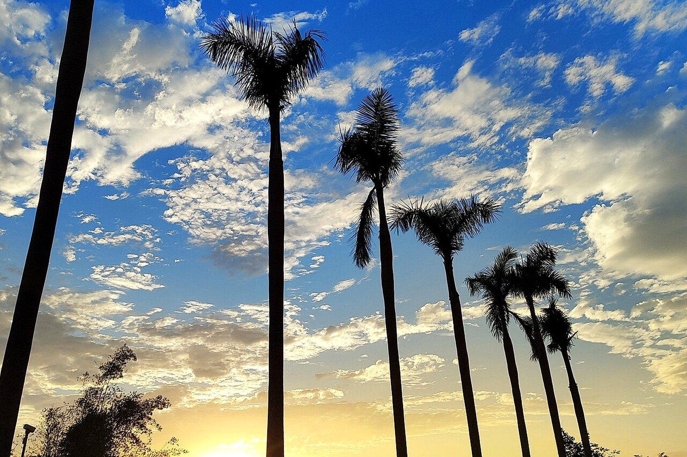

# Landscape, Street, Beach Portrait, and Motorcycle Photography Plan

## Visual direction

Avoid making seven days of identical blue-sea standing portraits. Build three visual groups:

1. **East-coast speed**: wind turbines, surfing, coastal roads, and motorcycle movement.
2. **Southern tropical portraits**: Wuzhizhou, Houhai, Yalong Bay, and hotel light.
3. **Haikou city memory**: arcades, old shops, street life, palms, and familiar urban texture.

## Location and lens table

| Place | Subject | Best time | Lens / method |
|---|---|---|---|
| Haikou Qilou | Street life, signs, arcade depth | 16:30 to blue hour | 35/50 mm; ask before close portraits |
| Mulan Bay | Turbines, lighthouse direction, road and motorcycle | 90 min before sunset | 70–200 mm compression plus a wide establishing frame |
| Riyue Bay | Surf action, shops, motorcycle | Suitable waves and sunset | 1/1000 action; 1/30 panning only safely |
| Shimei Bay / Shenzhou Peninsula | Palms, bends, two-person portraits | After 16:00 | 24–70 mm; low angle without lying in a road |
| Houhai | Village life, surfers, night atmosphere | Early morning or evening | 35 mm environmental portraits |
| Wuzhizhou | Water colour, sand, action camera | Morning to noon for water; later portraits | Use CPL carefully to preserve highlights |
| Yalong Bay | Wide tropical bay and layers | Before sunset | Wide angle plus telephoto layers |

## Six safe motorcycle shots

1. Three-quarter static portrait in a legal parking area.
2. Telephoto compression from well outside the traffic lane.
3. Low-speed panning only on a closed or genuinely safe side road.
4. Helmet close-up with the coast reflected in the visor.
5. Post-ride lifestyle frame: jacket off, camera in hand, walking toward the beach.
6. Sunset silhouette with both person and motorcycle inside a parking area.

Do not photograph wheelies, no-helmet riding, wrong-way riding, hands-off riding, or repeated turns in traffic.

## Beach styling

- White or sand-coloured linen shirt with dark swim shorts for clear southern water.
- Black quick-dry top or subtle riding gear with helmet for Wanning.
- Blue-grey or sand long sleeve with utility shorts for rocks and harbour texture.
- Avoid large fluorescent areas that contaminate water colour; one small red layer can be an accent.

## Equipment

- One or two bodies; 24–70 main, 16–35 landscape, 70–200 surf and distant street work.
- CPL, ND, cleaning tools, and enough cloths for salt spray.
- At least two batteries per body and multiple cards.
- Rain cover, 5–10 L dry bag, camera insert, and desiccant.
- Make two backups each night before changing hotels.

## Drone and street boundaries

- Recheck the civil aviation platform, airport clearance, site rules, and local signs for every launch.
- Do not fly or photograph near launch sites, airports, ports, military facilities, or unknown sensitive infrastructure.
- Obtain consent for identifiable close portraits.
- Do not publish precise access points to fragile or unofficial “secret” locations.
