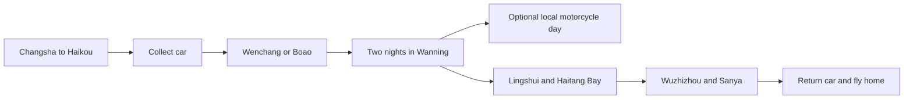
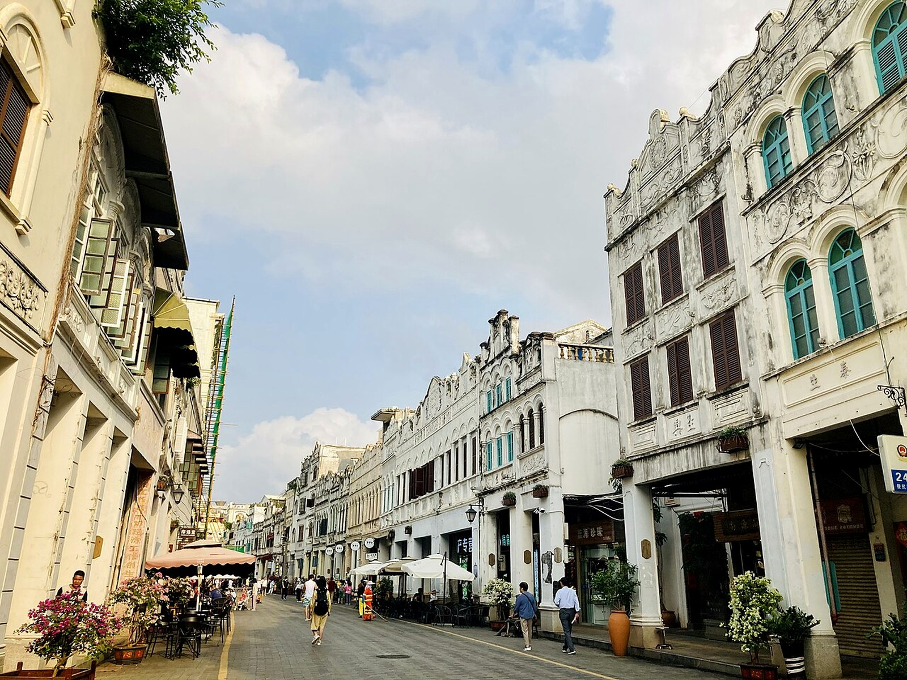
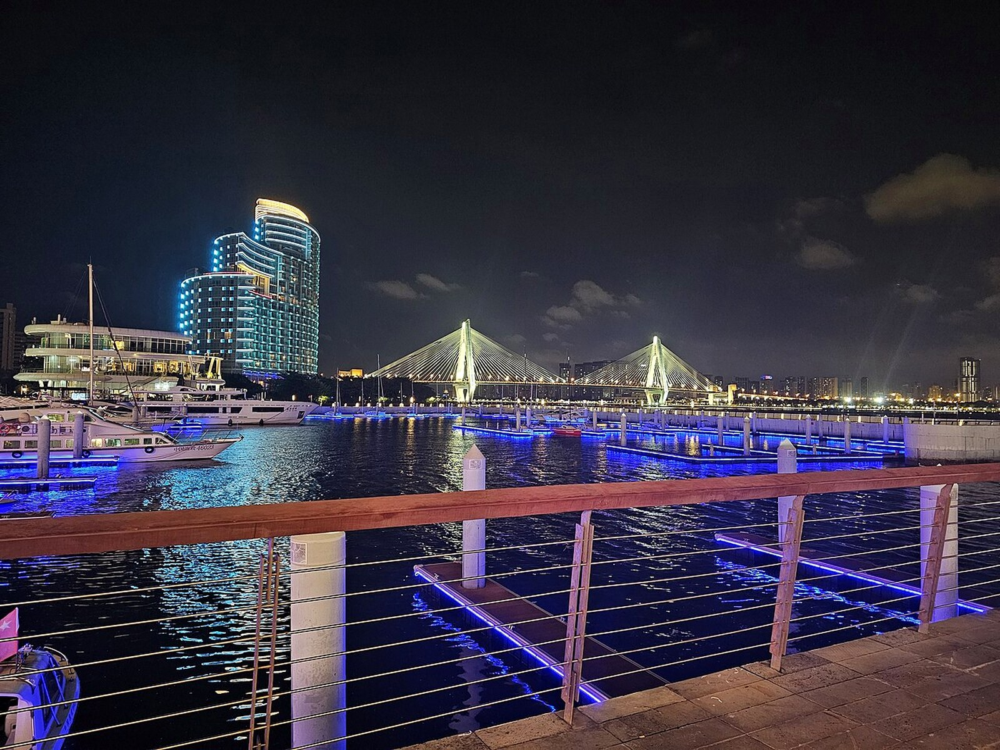

# Seven-Day Hainan East Coast Mixed-Transport Route

> Current discussion dates: August 15–21, 2026. Enter through Haikou and leave from Sanya, keeping Wanning surfing, limited motorcycle riding, Lingshui coast, Haitang Bay, and Wuzhizhou while dropping a full island loop.

## Transport model

This is not a motorcycle island tour. The car acts as the luggage and equipment base; a motorcycle is optional for one verified legal local section in Wanning.

### Hard limits

- Treat Haikou and Sanya city as no-motorcycle zones.
- Motorcycles cannot use Hainan expressways; all cross-city travel uses the car.
- Confirm permitted Wanning roads with local traffic police as well as the rental shop.
- The rider must hold the appropriate licence. The vehicle needs registration, compulsory insurance, suitable third-party cover, and a written contract.

## Daily itinerary

### D1 | August 15 | Changsha → Haikou

- Prefer a nonstop flight arriving around midday or afternoon.
- Collect and inspect the car, check in, and visit Qilou Old Street only if arrival is early enough.
- Schedule no water activity or motorcycle riding.

### D2 | August 16 | Haikou → Wenchang/Boao → Wanning, about 230–300 km

Choose only one stop between Mulan Bay and Boao. Cancel the stop in poor weather and continue to Wanning. Stay two nights near Shenzhou Peninsula, Shimei Bay, or Riyue Bay, prioritising parking and wet-gear drying.

### D3 | August 17 | Wanning surfing and coastal motorcycle option

Take a formal beginner surf lesson at Riyue Bay. If local roads and documents are confirmed, rent a motorcycle for a short legal section around Riyue Bay, Shimei Bay, or Shenzhou Peninsula. Photograph after 16:30 without blocking live roads.

### D4 | August 18 | Wanning → Lingshui → Houhai/Haitang Bay, about 130–180 km

Choose one short coastal stop at Xincun Port, Clear Water Bay, or a public coast near Chiling. Scout Houhai in the afternoon and stay two nights in Haitang Bay. Walk inside crowded village roads.

### D5 | August 19 | Wuzhizhou Island

Target the first ferry. Choose entry plus selected activities for a photography-first day; use a package only when the included items and refund rules are clear. Do not combine this day with demanding freediving or scuba training.

### D6 | August 20 | Sanya weather-flex day

Move Wuzhizhou here if D5 is cancelled. Otherwise choose Yalong Bay, Sanya Bay, rest, portraits, or a supervised local Hainan freediving experience. A full certification course is outside the main itinerary.

### D7 | August 21 | Sanya → Changsha

Check out, refuel, document the car condition, and return it in Sanya. Carry lithium batteries, cameras, and power banks in cabin baggage. Add no distant attraction that morning.

## Distance and driving load

| Section | Base estimate |
|---|---:|
| Haikou–Wenchang coast | about 90 km |
| Wenchang–Boao/Wanning | about 140–210 km |
| Wanning–Lingshui–Houhai | about 130–180 km |
| Houhai–Sanya | about 35 km |

Allow roughly 550–650 km after hotel, supply, and photography detours.

## Weather substitutions

- Heavy rain on D2: remove Wenchang/Boao and go directly to Wanning.
- Unsafe beginner surf conditions on D3: cancel surfing rather than forcing a prepaid activity.
- Wuzhizhou closure on D5: move it to D6.
- Closure on both D5 and D6: accept cancellation and protect the D7 flight.
