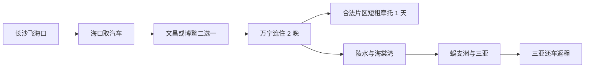
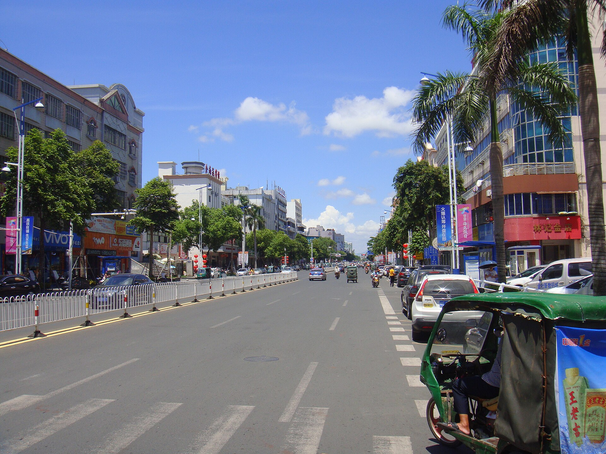
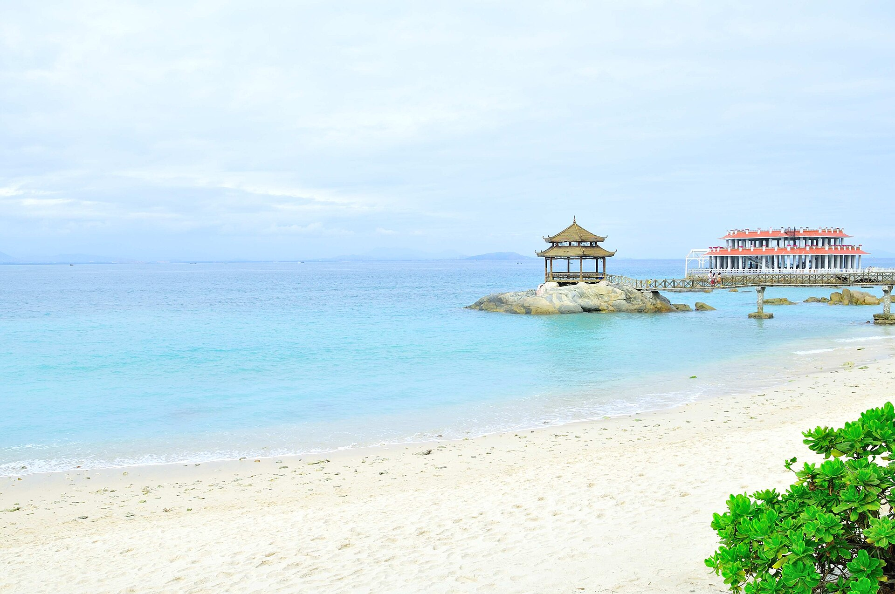
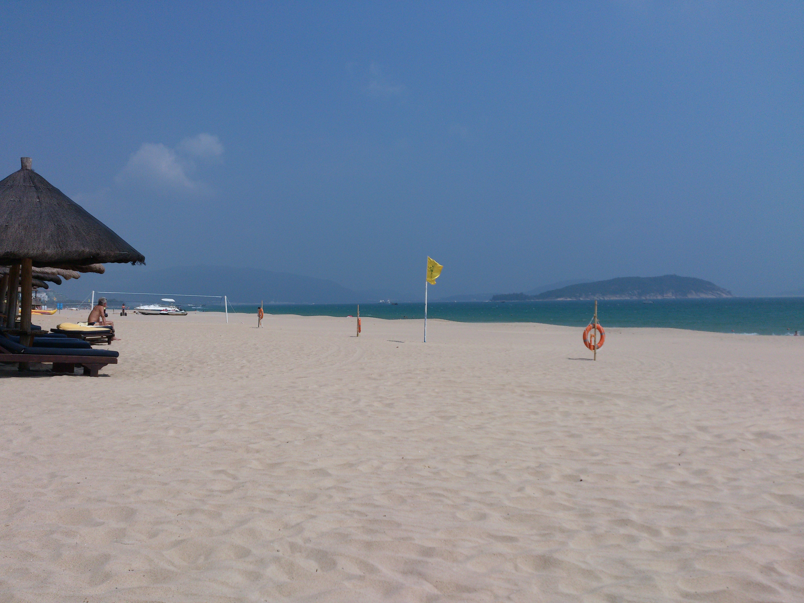

# 7 天海南东线混合交通路线

> 当前讨论版日期为 2026-08-15 至 2026-08-21。路线采用海口进、三亚出，重点保留万宁冲浪、局部摩托、陵水海岸、海棠湾和蜈支洲，主动放弃西线。

## 交通模型

这不是摩托环岛，而是“汽车母舰＋万宁局部摩托”：行李、头盔和相机放在汽车里，跨城只开车；到万宁后才考虑向正规店短租一天手续完整的摩托车。

### 硬约束

- 海口、三亚市区按禁摩处理，只开车、打车或步行。
- 摩托车不得进入海南高速公路；跨城全部使用汽车。
- 万宁局部骑行前同时向交警和租车行核对普通道路边界。
- 驾驶人持对应 D/E 驾照；车辆需有号牌、行驶证、交强险、覆盖承租人的商业三者险和书面合同。

法规来源：[海南省高速公路交通安全管理办法](https://www.hainan.gov.cn/hainan/szfbgtwj/201710/d8eca5de4c7a45d194aa3badde94e70e.shtml)；[海南省交通运输厅转载](https://jt.hainan.gov.cn/xxgk/0200/0202/201811/t20181122_1057044.html)。

## 逐日安排

### D1｜8 月 15 日｜长沙 → 海口

- 优先中午至下午抵达的直飞航班。
- 取车、验车、入住海口酒店；若落地不晚，16:30 后去骑楼老街和钟楼周边。
- 不安排水上项目或摩托。

### D2｜8 月 16 日｜海口 → 文昌/博鳌 → 万宁，约 230—300 公里

- 这是最长转场日，文昌木兰湾与博鳌只选一个，不同时打卡。
- 下午进入万宁后，在神州半岛或石梅湾择一拍日落。
- 万宁连住 2 晚，酒店优先免费停车、可放头盔和可晾晒冲浪装备。

### D3｜8 月 17 日｜万宁冲浪＋沿海摩托日

- 日月湾初学者区安排约 2 小时正规冲浪课，时间由教练按浪况、潮汐和风决定。
- 摩托为可选项：汽车停妥后，在日月湾—石梅湾—神州半岛中选择确认合法且不用上高速的一小段。
- 16:30 至日落拍机车照，不在车流中摆拍、压弯或逆行。

### D4｜8 月 18 日｜万宁 → 陵水 → 后海/海棠湾，约 130—180 公里

- 上午退房，陵水新村港、清水湾或赤岭公共海岸三选一短停。
- 下午到后海村熟悉码头与第二天上岛动线，海棠湾连住 2 晚。
- 后海拥挤村道不开摩托，汽车停车后步行。

### D5｜8 月 19 日｜蜈支洲岛全天

- 争取首批船，这是全程必须早起的一天。
- 摄影优先则购买门船票＋少量项目；只有明确要玩项目时才考虑套票。
- 不在同一天叠加自由潜、体验水肺或其他高强度课程。

### D6｜8 月 20 日｜三亚天气机动日

- 若 D5 因海况停航，优先把蜈支洲顺延到今天。
- 若蜈支洲已完成，安排亚龙湾、三亚湾、酒店休整和海边人像。
- 自由潜仅作为可选体验：必须选择正规教练和场地，不安排 AIDA2 完整课程。
- 三亚市区不骑摩托。

### D7｜8 月 21 日｜三亚 → 长沙

- 酒店退房、补油、检查划痕，在三亚还车。
- 锂电池、相机电池和充电宝随身携带。
- 不在返程日上午增加远距离景点。

## 里程与驾驶强度

| 路段 | 基础估算 |
|---|---:|
| 海口—文昌沿海 | 约 90 km |
| 文昌—博鳌/万宁 | 约 140—210 km |
| 万宁—陵水—后海 | 约 130—180 km |
| 后海—三亚 | 约 35 km |

基础约 400—515 km；加入酒店、补给、摄影点和市区移动后按 550—650 km 预算。7 天方案不再追求海南环岛旅游公路“完整打卡”。

## 天气导致的替换规则

- D2 东线降雨明显：减少文昌/博鳌停留，直接去万宁入住。
- D3 浪况不适合初学者：取消冲浪，改酒店休息和普通海岸摄影；不因已付款强行下水。
- D5 停航：蜈支洲顺延 D6；D6 原计划全部让位。
- D5、D6 连续停航：接受取消蜈支洲，不延误 D7 航班。
